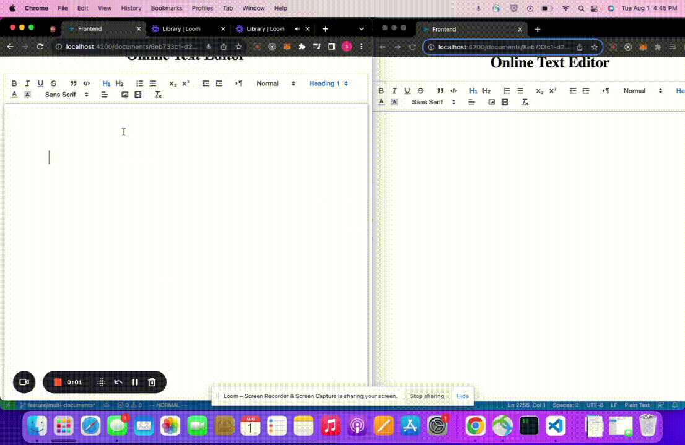

# Online Shared Text Editor
Welcome to the Online Shared Text Editor! This project allows multiple users to collaboratively edit and share text in real-time. It provides a seamless editing experience with instant updates across all connected users.




# Installation
Before getting started, ensure that you have Node.js version 19.9.0 installed on your system. You can download Node.js from the official website: https://nodejs.org

To set up the Online Shared Text Editor, follow these steps:

1. Clone the repository:

```bash
git clone https://github.com/shubham-pyc/fullstack-jenni.git
```
2. Install project dependencies:
```bash
cd fullstack-jenni
yarn install
```

3. Serve the backend:
```bash
nx serve backend
```


4. Serve the frontend

```bash
nx serve frontend
```

Once both the backend and frontend are running, you can access the Online Shared Text Editor by navigating to http://localhost:4200 in your web browser.


## Approach


1. ShareDB: A robust and mature backend database built on the principles of Operational Transformation to manage concurrent edits and conflicts effectively.

2. QuillJS: A modern and customizable rich text editor that provides a user-friendly interface for editing and formatting text content.

3. Websockets: The communication protocol of choice for real-time applications, ensuring instant data transmission between the server and clients.

4. React: A popular frontend library used to build the user interface, allowing for efficient component-based development and a seamless user experience.

